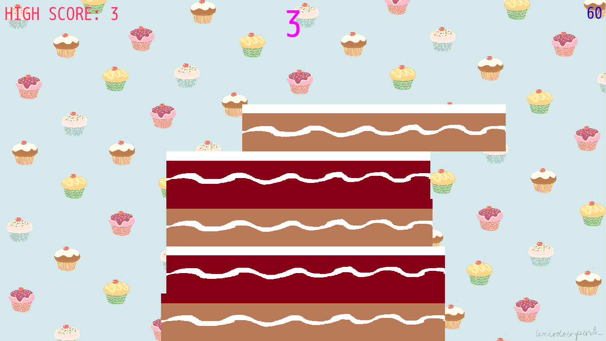

# cakestack

Simple cake stacking game done in [Ruby](https://www.ruby-lang.org) via [DragonRuby GTK](https://dragonruby.itch.io/dragonruby-gtk)!

The game made in 1 hour for [TeenyTiny DragonRuby MiniGameJam](https://itch.io/jam/teenytiny-dragonruby-minigamejam-2020) which is game jam made for DragonRuby game devs...

### Screenshots

  

### Controls

Just, Click or hit space key to stack!

### License

Game licensed under MIT license...

About 3rd party stuff, See [`info.txt`](https://github.com/Rabios/cakestack/blob/main/info.txt) for more info...